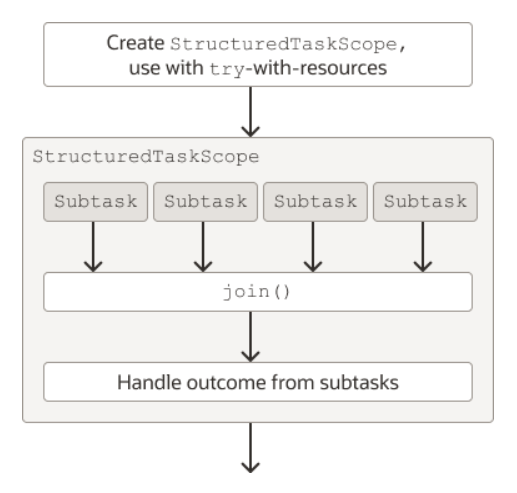

# Structured Concurrency (Preview)

## Context

Pretend to enhance reliability, maintainability and observability of multithreaded code by adopting concurrent
programming style, this reduces the likelihood of threads leaks and cancellations delays.


To use the StructuredTaskScope class, you follow these general steps:

- Create a StructuredTaskScope; use it with a try-with-resources statement.
- Define your subtasks as instances of Callable.
- Within the try block, fork each subtask in its own thread with StructuredTaskScope::fork.
- Call StructuredTaskScope::join.
- Handle the outcome from the subtasks.
- Ensure that the StructuredTaskScope is shut down.
- The following figure illustrates these steps. Notice that the task scope must wait for all subtasks to finish execution because of the join() method. Afterward, it can handle the results of the subtask.




```
Callable<String> task1 = ...
    Callable<Integer> task2 = ...

    try (var scope = new StructuredTaskScope<Object>()) {

        Subtask<String> subtask1 = scope.fork(task1);
        Subtask<Integer> subtask2 = scope.fork(task2);

        scope.join();

        ... process results/exceptions ...

    } // close
```