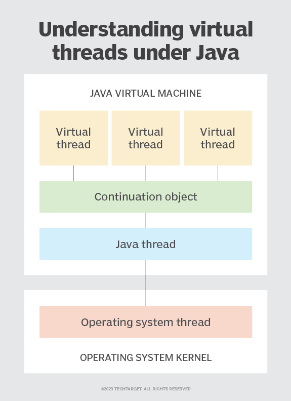

# Virtual Threads

## Context

Java 21 virtual threads are much lighter and more efficient than traditional operating system threads. Virtual threads are managed by the Java Runtime Environment (JRE).

A virtual thread is not a "thread" in the sense of operating system thread or the Java thread that's derived from a given operating system thread. Rather, 
a virtual thread is created using a special, private object named Continuation, which then creates the virtual thread against a Java thread.

When a virtual thread runs blocking code, which is code that forces threads to wait until an operation completes -- for example, executing an HTTP request to a web server 
-- the Continuation object unmounts the virtual thread from the Java thread it's using and moves the virtual thread's context into memory. 
The JRE keeps track of the call associated with the blocking code -- in this case, the HTTP request. Once the HTTP request returns a response, the virtual thread framework 
within the JRE creates a new virtual thread using the context stored in memory.

This notification pattern is similar to that of Node.js, which relegates blocking code to an event loop that notifies the Node.js runtime when code completes.



To create virtual threads, use the
```
Thread.virtualThread() or the Executors.newVirtualThreadPerTaskExecutor()
```
factory methods.


- #### [ Go to implementation](../src/main/java/com/learn/goals/VirtualThreads.java)